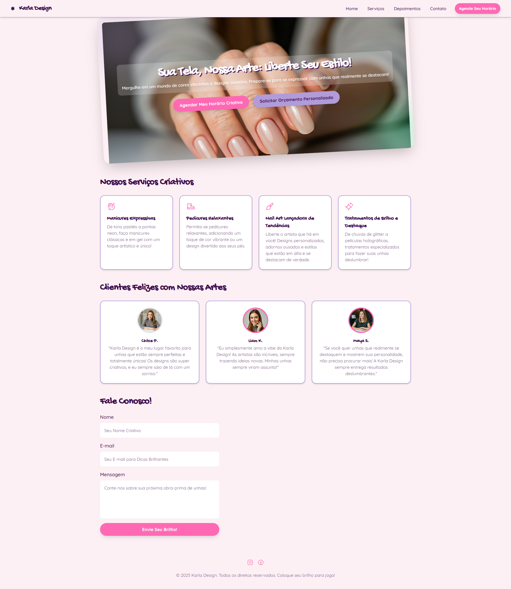

# 💅 Karla Design - Landing Page

Bem-vindo ao repositório da landing page "Karla Design"! Este é um projeto de site de página única, moderno e responsivo, desenvolvido para um estúdio de nail art. O design é vibrante, criativo e focado em proporcionar uma excelente experiência visual para o usuário.

## 🖼️ Visualização

_Insira aqui uma captura de tela do seu site!_

---

## 🔗 Demonstração Ao Vivo

Você pode ver o projeto em ação aqui:

**[Acesse o site](URL_DO_SEU_SITE_AQUI)**

---

## ✨ Funcionalidades

- **Design Responsivo**: Totalmente adaptado para visualização em desktops, tablets e celulares.
- **Navegação Suave**: Menu com links âncora que rolam suavemente para as seções correspondentes.
- **Menu Mobile**: Menu "hambúrguer" funcional para uma navegação fácil em telas menores.
- **Estilização Moderna**: Uso de Tailwind CSS para uma interface limpa e customizável.
- **Componentes Reutilizáveis**: Estrutura de fácil manutenção com classes utilitárias.
- **Seções**:
  - **Home**: Seção de herói com um design chamativo.
  - **Serviços**: Cards detalhando os serviços oferecidos.
  - **Depoimentos**: Prova social com testemunhos de clientes.
  - **Contato**: Formulário para os clientes entrarem em contato.

---

## 🚀 Tecnologias Utilizadas

- **HTML5**: Para a estrutura semântica da página.
- **Tailwind CSS**: Framework CSS utilitário para estilização rápida e responsiva, carregado via CDN.
- **JavaScript**: Para a interatividade do menu mobile.

---

## 🏁 Como Executar Localmente

Como o projeto utiliza apenas tecnologias front-end com dependências via CDN, não é necessário nenhum processo de build ou instalação complexa.

1.  Clone este repositório para sua máquina local.
2.  Abra o arquivo `index.html` em seu navegador de preferência.

E pronto! O site estará funcionando.
